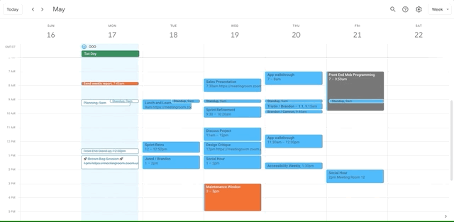

Simple chrome plugin for anonymizing events on google calendar. That way you can take and share a screenshot and easily provide your availability to someone.

Install on Chrome: https://chrome.google.com/webstore/detail/calendar-anonymizer/ohomnpjjapfpknombeifkplihfpjdomm 
Install on Firefox: https://addons.mozilla.org/en-US/firefox/addon/calendar-anonymizer/

Deploying to Chrome
- Rename `chrome.manifest.json` to `manifest.json`.
- Rename `chrome.background.js` to `background.js`.
- Zip the containing folder, upload to the google developer dashboard.

Deploying to Firefox
- Rename `firefox.manifest.json` to `manifest.json`.
- Rename `firefox.background.js` to `background.js`.
- Package files needed in accordance with (firefox's process)[https://extensionworkshop.com/documentation/publish/package-your-extension/].
